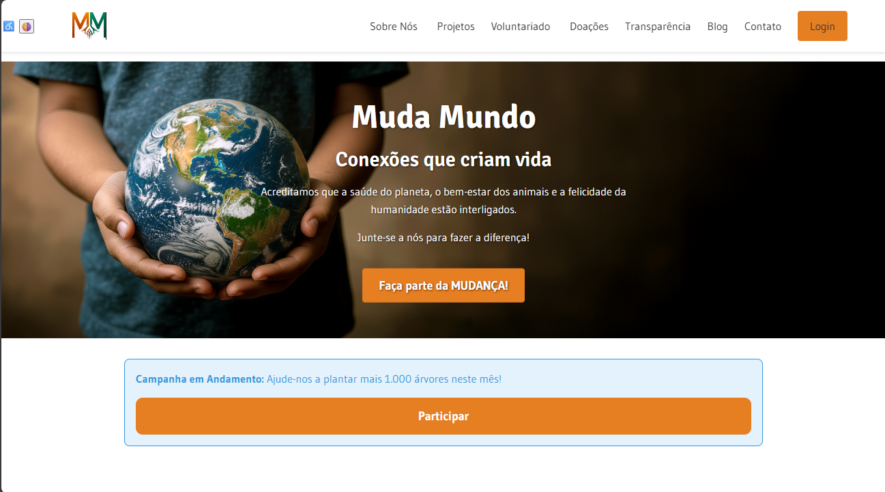
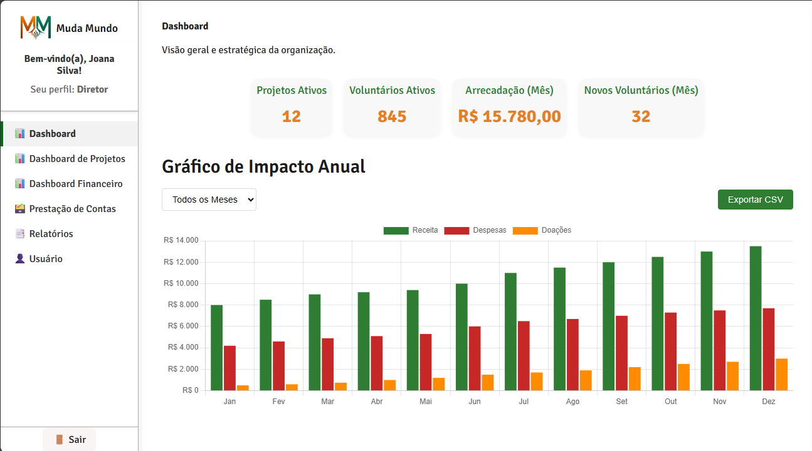

# 🌱 Muda Mundo – ONG


---

Plataforma Digital da ONG **Muda Mundo**, desenvolvida como projeto acadêmico da disciplina **Desenvolvimento Front-End para Web**.  
O sistema simula o funcionamento real de uma ONG, oferecendo um **site institucional público** e um **painel de gerenciamento privado** com diferentes perfis de acesso que representam a equipe de gestão, comunicação, finanças, TI e voluntariado.

---

## 🧭 Contexto do Projeto

Este projeto foi desenvolvido com o objetivo de aplicar os fundamentos de **HTML**, **CSS** e **JavaScript** em uma aplicação completa e funcional.  
O **Muda Mundo** busca demonstrar boas práticas de design, acessibilidade e organização de código, incluindo:

- Estrutura semântica e navegação acessível (WCAG 2.1 – Nível AA);
- Modularização e minificação de arquivos para produção;
- Simulação de perfis de usuários com rotas dinâmicas no painel;
- Visualização de dados com **Chart.js** e geração de certificados em **PDF** com **jsPDF**.

---

## ⚙️ Tecnologias Utilizadas

**Linguagens:**  

- HTML5  
- CSS3  
- JavaScript (ES6+)

**Bibliotecas JavaScript:**  

- [Chart.js](https://www.chartjs.org/)  
- [jsPDF](https://github.com/parallax/jsPDF)

**Ferramentas:**  

- [Visual Studio Code](https://code.visualstudio.com/)  
- [Git e GitHub](https://github.com/)  
- [GitHub Pages](https://pages.github.com/)

---

## 🗂️ Estrutura de Pastas

```bash
│   index.html
│   README.md
│
├───css
│   │   style.css
│   └───modulos
│           dashboard.css
│           design-system.css
│           global-public.css
│           grid.css
│           private.css
│           projetos.css
│           responsividade.css
│           sections.css
│
├───dist
│   ├───css
│   │   style.min.css
│   │   └───modulos.min
│   │           dashboard.min.css
│   │           design-system.min.css
│   │           global-public.min.css
│   │           grid.min.css
│   │           private.min.css
│   │           projetos.min.css
│   │           responsividade.min.css
│   │           sections.min.css
│   └───js
│           acessibility.min.js
│           app.min.js
│           components.min.js
│           data.min.js
│           formValidation.min.js
│           router.min.js
│
├───docs
│       certificado-modelo.pdf
│       Relatorio_Anual_2024_MudaMundo.pdf
│
├───HTML
│   │   blog.html
│   │   cadastro.html
│   │   contato.html
│   │   doacoes.html
│   │   login.html
│   │   painel.html
│   │   projetos.html
│   │   sobre.html
│   │   transparencia.html
│   │   voluntariado.html
│   └───componentes
│           [arquivos de seções dinâmicas do painel]
│
├───img
│       [logos, ícones e imagens otimizadas em SVG e PNG]
│
└───js
        acessibility.js
        app.js
        components.js
        data.js
        formValidation.js
        router.js
```

## 👥 Perfis de Acesso (Painel Privado)

O sistema conta com diferentes perfis que simulam a equipe de uma ONG real.
Use as credenciais abaixo para explorar o painel administrativo:

| Perfil                 | E-mail                                                          | Senha    | Nível de Acesso                       |
| ---------------------- | --------------------------------------------------------------- | -------- | ------------------------------------- |
| Diretora               | [diretor@mudamundo.org](mailto:diretor@mudamundo.org)           | 12345678 | Acesso total                          |
| Gerente Financeiro     | [gerente.fin@mudamundo.org](mailto:gerente.fin@mudamundo.org)   | 12345678 | Gestão de finanças                    |
| Gerente de Projetos    | [gerente.proj@mudamundo.org](mailto:gerente.proj@mudamundo.org) | 12345678 | Gestão de projetos                    |
| Gerente de Comunicação | [gerente.com@mudamundo.org](mailto:gerente.com@mudamundo.org)   | 12345678 | Gestão de mídia e campanhas           |
| Equipe Financeira      | [equipe.fin@mudamundo.org](mailto:equipe.fin@mudamundo.org)     | 12345678 | Lançamentos e relatórios financeiros  |
| Equipe de Projetos     | [equipe.proj@mudamundo.org](mailto:equipe.proj@mudamundo.org)   | 12345678 | Atualização de projetos e voluntários |
| Equipe de Comunicação  | [equipe.com@mudamundo.org](mailto:equipe.com@mudamundo.org)     | 12345678 | Produção de postagens e materiais     |
| TI                     | [ti@mudamundo.org](mailto:ti@mudamundo.org)                     | 12345678 | Administração de usuários             |
| Voluntário             | [voluntario@mudamundo.org](mailto:voluntario@mudamundo.org)     | 12345678 | Área pessoal e oportunidades          |

## 🚀 Como Executar o Projeto

Acesse diretamente pelo GitHub Pages:
🔗 <https://kamilladpaula.github.io/ONG-MudaMundo/>

## 🖼️ Imagens do Projeto

Página Inicial


Painel Privado – Diretora


## 🧩 Estrutura de Versionamento

Este projeto segue o fluxo de trabalho GitFlow, com as seguintes branches principais:

**main** — versão estável e publicada no GitHub Pages

**develop** — integração e testes gerais

**feature/\*** — desenvolvimento de novas funcionalidades

**release/\*** — preparação de versões finais

Commits semânticos foram utilizados, seguindo o padrão:

**feat:** implementação de nova funcionalidade  
**fix:** correção de erro  
**chore:** ajustes e melhorias de build  
**refactor:** reestruturação de código  

## 📚 Versão Atual

**Versão:** v1.0.0
**Status:** ✅ Finalizada e otimizada para produção
Inclui: minificação, acessibilidade WCAG 2.1, e otimização de imagens SVG.

## 📄 Licença

Projeto acadêmico desenvolvido por Kamilla de Paula Pereira
Disciplina: Desenvolvimento Front-End para Web – Cruzeiro do Sul Virtual
© 2025 – Uso educacional. Todos os direitos reservados.
